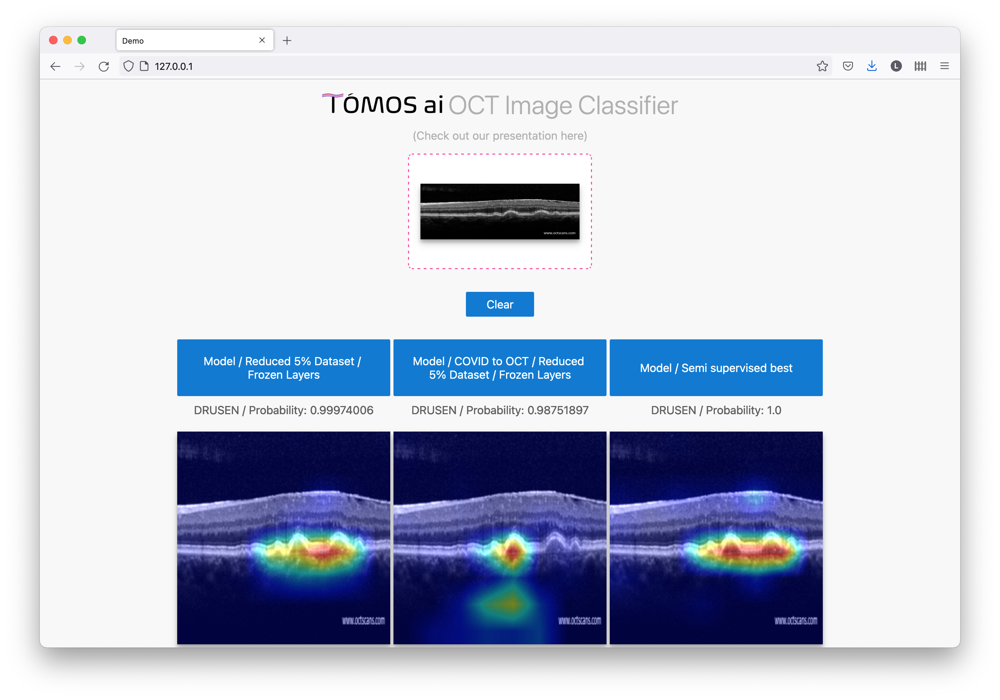

**Notice**<br>
This repository is derived from: https://github.com/imfing/keras-flask-deploy-webapp. Some modifications were made.

The following instructions may not work, if I have some time in the future I'll review them.

# FourthBrain capstone project demo
[](http://perso.crans.org/besson/LICENSE.html)
[]()


For this to work three models need to be updated to the models folder and also that needs to be configures in the model.py if the names don't match.

Screenshot:

<p align="center">
  
</p>


## Getting Started

- Clone this repo
- Install requirements
- Run the script
- Go to http://localhost
- Done!

## New Features

- Support image drag-and-drop
- Use vanilla JavaScript, HTML and CSS. Remove jQuery and Bootstrap

------------------

## Run with Docker

**Note**: not tested!

With **[Docker](https://www.docker.com)**, you can quickly build and run the entire application in minutes :whale:

```shell
# 1. First, clone the repo
$ git clone https://github.com/tomos-ai/capstone-demo.git
$ cd capstone-demo

# 2. Build Docker image
$ docker build -t capstone-demo .

# 3. Run!
$ docker run -it --rm -p 80:80 capstone-demo
```

Open http://localhost and wait till the webpage is loaded.

## Local Installation

It's easy to install and run it on your computer.

```shell
# 1. First, clone the repo
$ git clone https://github.com/tomos-ai/capstone-demo.git
$ cd capstone-demo

# 2. Install Python packages
$ pip install -r requirements.txt

# 3. Run!
$ python app.py
```

Open http://localhost and have fun.

------------------

## Deployment

To deploy it for public use, you need to have a public **linux server**.

<details>
 <summary>Details</summary>

### Run the app

Run the script and hide it in background with `tmux` or `screen`.
```
$ python app.py
```

**Note**: `gunicorn` not tested!

You can also use gunicorn instead of gevent
```
$ gunicorn -b 127.0.0.1 app:app
```

More deployment options, check [here](https://flask.palletsprojects.com/en/1.1.x/deploying/wsgi-standalone/)

### Set up Nginx

**Note**: not tested!

To redirect the traffic to your local app.
Configure your Nginx `.conf` file.

```
server {
  listen  80;

  client_max_body_size 20M;

  location / {
      proxy_pass http://127.0.0.1;
  }
}
```

</details>

## More Resources

[Building a simple Keras + deep learning REST API](https://blog.keras.io/building-a-simple-keras-deep-learning-rest-api.html)
